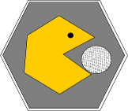

<!-- README.md is generated from README.Rmd. Please edit that file -->

```{r, echo = FALSE}
knitr::opts_chunk$set(
  collapse = TRUE,
  comment = "#>",
  fig.path = "README-"
)
```



# ingestr

[](https://travis-ci.org/jpshanno/ingestr)
[](https://codecov.io/github/jpshanno/ingestr?branch=master)

_An R package for reading environmental data from raw formats into dataframes._ 

This is project was initiated at the inagural [IMCR Hackathon](https://github.com/IMCR-Hackathon/HackathonCentral).  The end product of this effort will be an R package on CRAN.  The package will primarily deal with reading data from files, though there will be some utilities for initial cleanup of files such as removing blank rows and columns at the end of a CSV file.

The guiding principles of the project are that
1. All sources of environmental-related data should be easy to read directly
2. Reading in data should provide a standard output
3. Header information contained within sensor data files should be stored in a standard, easily readable format
4. Associating imported data with its original source is the first step towards good data provenance records and reproducibility

_Contributing_

## Installation

You can install ingestr from github with:

```{r gh-installation, eval = FALSE}
# install.packages("devtools")
devtools::install_github("jpshanno/ingestr")
```

## Ingesting Data

Many sensors provide their output as delimited files with header information contained above the recorded data. Each ingestr function to read in data starts with `ingest_` to make autocomplete easier. Running any ingest function will read in the data and format the data into a clean R data.frame. Column names are taken directly from the data file, and users have the option to read the header information into a separate data frame in the environment where the function was called. A message and the dat.frame structure will be printed to alert the user that the data.frame was created. All data and header data that are read in will have the data source appended as a column to the data.

```{r example}
library(ingestr)
campbell_file <- 
  system.file("example_data",
              "campbell_scientific_tao5.dat",
              package = "ingestr")

campbell_data <- 
  ingest_campbell(file.name = campbell_file,
                  add.units = TRUE,
                  add.measurements = TRUE,
                  header.info = TRUE,
                  header.info.name = "header_campbell")

str(campbell_data)

str(header_campbell)
```

### Incorporate File Naming Conventions as Data


### Batch Ingests

## Preliminary Clean-up Utilities

## QAQCR


```{r eval=FALSE, include=FALSE}

# ingestr

[](https://travis-ci.org/jpshanno/ingestr)
[](https://codecov.io/github/jpshanno/ingestr?branch=master)

R package for reading environmental data from raw formats into dataframes. 

This is an alpha work in progress initiated at the inagural [IMCR Hackathon](https://github.com/IMCR-Hackathon/HackathonCentral).  The end product of this effort will be an R package on CRAN.  The package will primarily deal with reading data from files, though there will be some utilities for initial cleanup of files such as removing blank rows and columns at the end of a CSV file.

We're just getting started, so expect things to break!

# Reading in Files

Scientific data files are produced in many formats by many means. Here's what's on our radar.

* Sensors
    * [Campbell Scientific](https://www.campbellsci.com/blog/tool-to-import-data-to-r)
    * Solinst
    * iButton
    * EGM4 - todo
    * Hobo - todo
    * YSI - todo
    * others?
* Instrument Reports
    * Shimadzu
    * Horiba
    * Plate reader
* Non-sensor-originated data, organized by data source
    * HTML
        * https://www.esrl.noaa.gov/psd/enso/mei/table.html
        * http://research.jisao.washington.edu/pdo/PDO.latest
    * PDF
    * NetCDF
        * CF-compliant
        * Non-CF-compliant
    * Excel/Data notebook
    * Text/CSV/ASCII
    * Databases

# Helper Utilities

The package should be able to parse a single file or all files in a folder or zip file. If batch reading files then files should be checked for duplicate contents.

Assuming the user has set up several scripts in a folder for batch processing files, the package should support batch running all scripts in that folder.

The package should be able to extract information from filenames, such as station, date, variable, into columns within the data frame. For example if a set of file names read as "site-variable-year" (152-soil_moisture-2017, 152-soil_temperature-2017, 140-soil_moisture_2017, etc), then the function would take an argument supplying the template as column headers: "site-variable-year".

The package should be able to split a single column in the original data into multiple columns in the data frame, a la [tidyr](http://tidyr.tidyverse.org/).

# Cleanup Utilities

These are cleanup utilities that make sense to include in the data ingestion step.
* Remove blank rows and columns
* Find exact duplicates at the row level and flag or delete them
* Put datetimes in standard format.
    * ISO example datetime: 2018-06-12T16:33-06
  
# Provenance

Any function we make should record the source file as part of the data.

If data cleaning is performed, a separate data frame is output with three columns: the original filename, the line of text or data from the original file that was cleaned or removed, and the reason.

```
